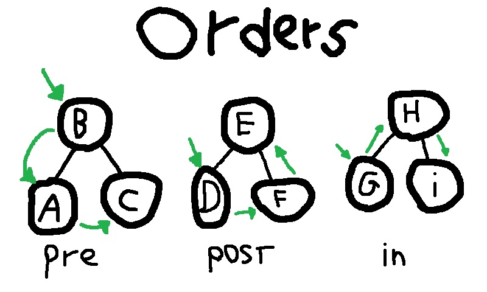

<div align="center">

DP-iterator-example
===================

[](https://github.com/nasccped/kojamp)
[](#)

</div>

This repository is an attempt to implement the iterator pattern code
piece located at _Design Patters: Elements of Reusable Object-Oriented Software_[^design-patterns-book]
_(page 66/358)_.


The implementation is an interface-based contract that offers usefull
ways to iterate over Objects that holds a collection of elements
(`List`, `Set`, `Map`, `...`). I chose a binary tree 'cause it
provides three common ways to iterate over it's data:

1. **Pre-Order:** when we look to the current node, then, the left
   and right one, respectively.
2. **Post-Order:** when we look to the left node, then, the right and
   current one, respectively.
3. **In-Order:** when we look to the left node, then, the current and
   right one, respectively.

<div align="center">



_image 1: orders repr_

</div>

> [!TIP]
>
> Keep in mind that all ordering traversals works in a recursive way,
> so:
>
> - `Pre-Order` will start the iteration from the current node and
>   then, navigates left to right in our tree _(trees first, leafs
>   last)**(unsorted)**_
> - `Post-Order` will start the iteration from the left node and
>   then, goes to right in our tree, but leaving the current node for
>   last _(leafs first, trees last)**(unsorted)**_
> - `In-Order` will start from the _"most-left"_ subtree and navigate
>   to the _"most-right"_ by passing through the current node _(left
>   leaf - current node - right leaf schema)**(sorted)**_

## Cloning, compiling and running

To clone the project you can:

```sh
# clone using git
git clone https://github.com/nasccped/DP-iterator-example
# remove git folder (works for bash based terminals, only)
rm -rf DP-iterator-example/.git/
# goto dir
cd DP-iterator-example
```

### Compiling

Since this project was built under the kojamp[^kojamp] project
manager, you can use it to handle the project, or:

- compile using a bash terminal (Linux):
```sh
javac $(find src -type f -name **.java) -d out
```
- compile using a powershell terminal (Windows):
```powershell
javac (Get-ChildItem -Recurse -Path src -Filter *.java | ForEach-Object { $_.FullName }) -d out
```

Finally, you can execute the program by running:
```sh
java --class-path out IteratorExample
```

> [!IMPORTANT]
>
> Make sure to uncomment the code that _"runs"_ the stuff:
>
> ```java
> public static void main(String[] args) {
>     // a lot of code...
>     String sourcePath = "src/IteratorExample.java";
>     Printer.echoln(
>         "All the important calls are at `"
>         + yellow(sourcePath) + "`'s main function.\n"
>         + "You should uncomment the code to see the impl working...\n");
>     // uncomment the following code (~line 70)
>     // inOrderExample();
>     // preOrderExample();
>     // postOrderExample();
>   }
> ```

## Why not use the Java's built-in `Iterator` interface?

If you already have experience with Java development, you probably
know that the JDK provides an
[`Iterator`](https://docs.oracle.com/javase/8/docs/api/java/util/Iterator.html)
utility. So, why did I create a new interface instead of using the
built in one?

### The `Iterator` reference

Even though the Java's iterator provide usefull features, my
interface is based on this C++ code sample (from the _Design
Patterns_ book):

```cpp
Glyph* g;
Iterator<Glyph*>* i = g->CreateIterator();

for (i->First(); !i->IsDone(); i->Next()) {
    Glyph* child = i->CurrentItem();

    // do something with current child
}
```

Key points (apparently):
- `i->First()` initializes the iterator
- `i->IsDone()` checks if the iterator is done
- `i->Next()` moves to the next item in our iterator
- `i->CurrentItem()` returns the current item in our iterator

So, I've decided to use this features to build my own iterator
interface
([`src/iterators/DPIterator.java`](src/iterators/DPIterator.java)).

> [!NOTE]
>
> I mostly mention the interface, but abstract class concept is also
> used under this project. Consider _"interface"_ not as the Java's
> feature, but the concept itself. (**interface** as Java's both
> `interface` and `abstract class`).

[^design-patterns-book]: _Design Patters: Elements of Reusable Object-Oriented Software_
  is a software engineering book that describes software design
  patterns. You can find it at [amazon website](https://www.amazon.com/Design-Patterns-Elements-Reusable-Object-Oriented/dp/0201633612).

[^kojamp]: Kojamp is a Java and Kotlin project manager I built. You
  can find more info on it's
  [official repository](https://github.com/nasccped/kojamp)
